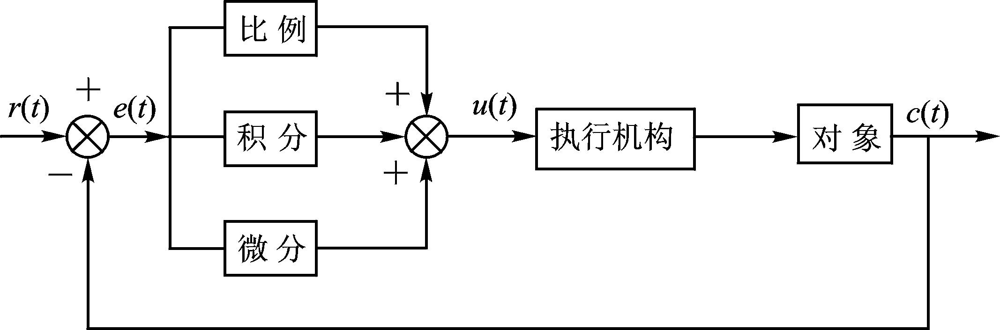
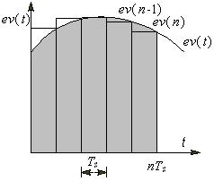
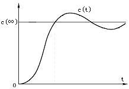

## 1、PID通俗理解
PID(proportional-integral-derivative)是比例、积分、微分的简称，分别代表了三种控制算法，通过这三个算法的组合可有效地纠正被控制对象的偏差，从而使其达到一个稳定的状态。

- Proportion，输入偏差乘以一个常数；
- Integral，对输入偏差进行积分计算；
- Derivative，对输入偏差进行微分计算；

其中输入偏差为读取的被控制对象的值与设定值的差，例如：要把速度控制在100/s，而根据当前批次的信息计算出来的速度为128/s，则100为`设定值`而128为`实际值`，偏差就为128-100=28/s。

**那么PID三个算法的实际含义是什么呢 ？**

- P，若实际值为20/s，设定值为100/s，则比例项P的作用就是以最快的速度到达100，实际为一个常数例如为1，表示每次增加实际值的一倍。 比例系数如果太小调节缓慢所需的总时间过长，若比例系数过大容易调节过头，导致来回震荡系统稳定性差。

- I，积分项I起到减小误差的作用，PID控制程序是周期性执行的，计算机的程序用下图中各矩形面积之和来近似精确的积分，图中的TS就是采样周期。每次PID运算时，在原来的积分值的基础上增加一个与当前的误差值ev（n）成正比的微小部分。误差为负值时，积分的增量为负。因此积分部分的作用是消除稳态误差，提高控制精度，积分作用一般是必须的。 

- D，微分就是求导，求导后的梯度方向为上升速度最快的方向，微分项D就是起加快调节过程的作用。误差的微分就是误差的变化速率，误差变化越快，其微分绝对值越大。误差增大时其微分为正；误差减小时其微分为负。控制器输出量的微分部分与误差的微分成正比，反映了被控量变化的趋势。 

 上图中的c(∞)为被控量c(t)的稳态值或被控量的期望值，误差**e(t)= c(∞)- c(t)**。在图中启动过程的上升阶段，当 时被控量尚未超过其稳态值。但是因为误差e(t)不断减小，误差的微分和控制器输出的微分部分为负值，减小了控制器的输出量，相当于提前给出了制动作用，以阻碍被控量的上升，所以可以减少超调量。因此微分控制具有超前和预测的特性，在超调尚未出现之前，就能提前给出控制作用。 

闭环控制系统的振荡甚至不稳定的根本原因在于有较大的滞后因素。因为微分项能预测误差变化的趋势，这种“超前”的作用可以抵消滞后因素的影响。适当的微分控制作用可以使超调量减小，增加系统的稳定性。对于有较大的滞后特性的被控对象，如果PI控制的效果不理想，可以考虑增加微分控制，以改善系统在调节过程中的动态特性。如果将微分时间设置为0，微分部分将不起作用。 微分时间与微分作用的强弱成正比，微分时间越大，微分作用越强。如果微分时间太大，在误差快速变化时，响应曲线上可能会出现“毛刺”。

>闭环控制是根据控制对象输出反馈来进行校正的控制方式，它是在测量出实际与计划发生偏差时，按定额或标准来进行纠正的。

PID控制程序是周期性执行的，执行的周期称为采样周期。采样周期越小，采样值越能反映模拟量的变化情况。但是太小会增加CPU的运算工作量，相邻两次采样的差值几乎没有什么变化，将使PID控制器输出的微分部分接近为零，所以也不宜将采样周期取得过小。应保证在被控量迅速变化时（例如启动过程中的上升阶段），能有足够多的采样点数，不致因为采样点数过少而丢失被采集的模拟量中的重要信息。

## 2、PI & PID控制器
控制器输出中的积分项与当前的误差值和过去历次误差值的累加值成正比，因此积分作用本身具有严重的滞后特性，对系统的稳定性不利。如果积分项的系数设置得不好，其负面作用很难通过积分作用本身迅速地修正。而比例项没有延迟，只要误差一出现，比例部分就会立即起作用。因此积分作用很少单独使用，它一般与比例和微分联合使用，组成PI或PID控制器。 

PI和PID控制器既克服了单纯的比例调节有稳态误差的缺点，又避免了单纯的积分调节响应慢、动态性能不好的缺点，因此被广泛使用。 如果控制器有积分作用（例如采用PI或PID控制），积分能消除阶跃输入的稳态误差，这时可以将比例系数调得小一些。   如果积分作用太强（即积分时间太小），其累积的作用会使系统输出的动态性能变差，调量增大，甚至使系统不稳定。积分作用太弱（即积分时间太大），则消除稳态误差的速度太慢，积分时间的值应取得适中

> PID控制器既克服了单纯的比例调节有稳态误差的缺点，又避免了单纯的积分调节响应慢、动态性能不好的缺点，因此被广泛使用。 PID控制的难点不是编程而是控制器的参数整定，参数整定的关键是正确地理解各参数的物理意义。